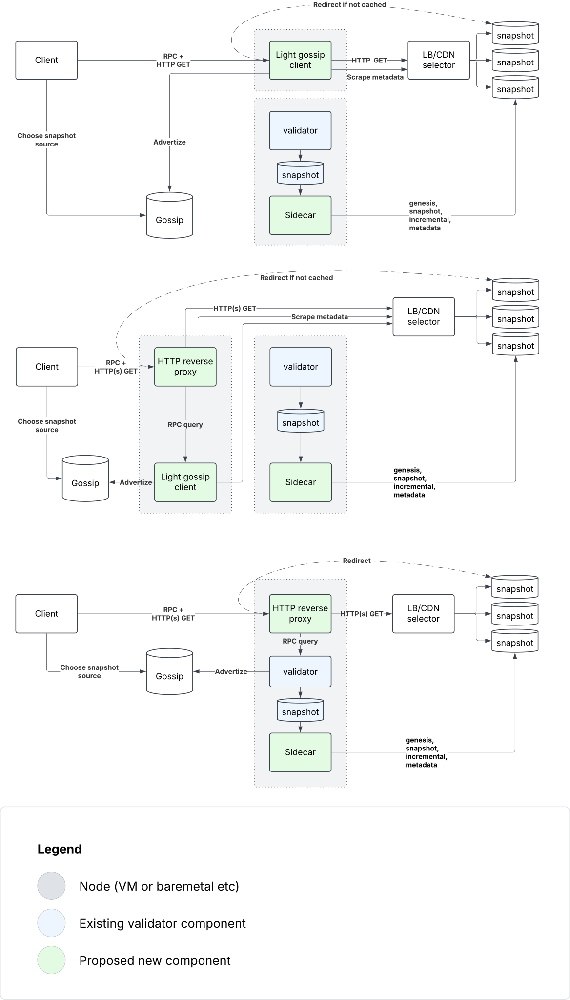

# Solana Snapshot Delivery Network (SSDN) Gossip Client

## Overview

The SSDN Gossip Client is part of a solution to decouple snapshot serving from validator operations in the Solana network. It enables scalable snapshot distribution without impacting validator performance.

## Problem Statement

Current snapshot distribution has several limitations:
- Existing validators and RPC providers are overwhelmed with snapshot requests, and they are limited in number due to the added performance overhead
- Snapshot serving impacts critical validator operations
- Snapshot serving impacts critical RPC provider operations
- No scalability during high-demand periods (e.g., network restarts)
- No dedicated infrastructure for snapshot distribution

## Solution

This project, along with [agave-snapshot-uploader](https://github.com/Blockdaemon/agave-snapshot-uploader), provides a scalable snapshot delivery network by:
1. Decoupling snapshot distribution from validator/RPC operations
2. Reusing the existing discovery mechanism for snapshot sources
3. Maintaining compatibility with existing validator clients
4. Supporting flexible deployment options

### Key Features
- Gossip network integration for discovery
- Bare minimum required RPC endpoint compatibility (`getSlot`, `getVersion`, `getGenesisHash`)
- STUN support for public IP detection
- UPnP support for NAT traversal

## Architecture

The system supports three deployment models:

1. **Independent Gossip Client**
   - Separate gossip client
   - Uploader sidecar on validator

2. **Independent Client + Reverse Proxy**
   - Separate gossip client
   - Reverse proxy
   - Uploader sidecar on validator

3. **Simplified Legacy Setup - No Gossip Client**
   - No separate gossip client
   - All components on single host
   - Reverse proxy
   - Uploader sidecar



## Configuration

### Quick Start

1. Generate a keypair (if needed):
   ```bash
   solana-keygen new -o keypair.json
   ```

2. Create a `config.toml` file (optional, see [example-config.toml](example-config.toml))

3. Run the client:
   ```bash
   RUST_LOG=warn cargo run
   ```
   or
   ```bash
   RUST_LOG=snapshot_gossip_client=info cargo run
   ```

### Configuration Options

Use `--config <path>` to specify a custom config file location. Default is `config.toml` in the current working directory.

| Option           | Default                   | Description                 |
|------------------|---------------------------|-----------------------------|
| `entrypoints`    | Testnet                   | Gossip network entry points |
| `genesis_hash`   | Testnet                   | Genesis hash                |
| `shred_version`  | Testnet                   | Shred version               |
| `keypair_path`   | `keypair.json`            | Path to keypair file        |
| `listen_ip`      | `0.0.0.0`                 | Local bind/listen IP        |
| `public_ip`      | Auto (STUN)               | Public IP address           |
| `stun_server`    | `stun.l.google.com:3478`  | STUN server address         |
| `gossip_port`    | `8001`                    | Gossip listen port          |
| `rpc_port`       | `8899`                    | RPC listen port             |
| `enable_upnp`    | `false`                   | Enable UPnP port forwarding |
| `storage_path`   | None                      | Redirect/proxy target       |
| `enable_proxy`   | `false`                   | Reverse proxy GET requests instead of redirecting |

**Note**: If you override the default `entrypoints`, you must also specify the `genesis_hash` and `shred_version`.

### Network Requirements

- Static public IP address
- Ingress allow/forward list:
  - UDP port 8001 (gossip) - if you need to be a publicly reachable gossip entrypoint (optional)
  - TCP port 8899 (RPC) - A publicly reachable RPC endpoint is required for validators to accept snapshots from you

**Note**: STUN-based IP detection and UPnP port forwarding are not recommended for production. Use explicit `public_ip` configuration instead, and configure port firewall/forwarding rules manually.

## Known Issues
   - The agave solana validator client may not honor HTTP redirect, so `enable_proxy` may be required (issue #17)[https://github.com/Blockdaemon/agave-solana-validator/issues/17].
   - `getSlot` returns zero ([issue #5](https://github.com/Blockdaemon/agave-snapshot-gossip-client/issues/5)).
   - Large dependency footprint from `solana_gossip`, huge memory and CPU usage for large gossip networks.
   - We do not periodically renew the UPnP port mappings, so if the router expires it, you may lose connectivity if you rely on on it ([issue #11](https://github.com/Blockdaemon/agave-snapshot-gossip-client/issues/11)).
   - For a detailed analysis of the benefits, limitations, and production considerations of the SSDN implementation, please see [TRADEOFFS.md](TRADEOFFS.md).


## License

[Apache 2.0](LICENSE)
