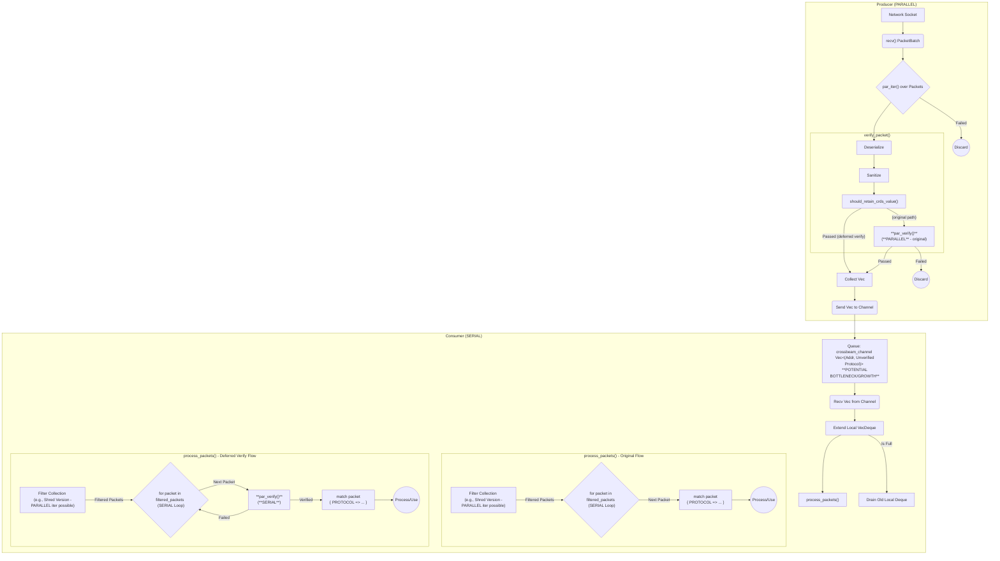

```mermaid
graph TD
    subgraph Thread: run_socket_consume ["Producer (PARALLEL)"]
        A[Network Socket] --> B("recv()" PacketBatch);
        B --> C{"par_iter() over Packets"};
        C --> D["verify_packet()"];
        subgraph "verify_packet()"
            D[Deserialize] --> D2[Sanitize];
            D2 --> D3["should_retain_crds_value()"];
            D3 -- (original path)--> D4["**par_verify()** <br/> (**PARALLEL** - original)"];
        end
        D3 -- "Passed (deferred verify)" --> E[Collect Vec];
        D4 -- "Passed" --> E[Collect Vec];
        D4 -- "Failed" --> F4((Discard));
        C -- Failed --> F((Discard));
        E --> G(Send Vec to Channel);
    end

    G --> H["Queue: crossbeam_channel <br/> Vec<(Addr, Unverified Protocol)> <br/> **POTENTIAL BOTTLENECK/GROWTH**"];

    subgraph Thread: run_listen ["Consumer (SERIAL)"]
        H --> I(Recv Vec from Channel);
        I --> J[Extend Local VecDeque];
        J --> L["process_packets()"];
        J -- Is Full --> K["Drain Old Local Deque"];

        subgraph "process_packets() - Original Flow"
            M_orig["Filter Collection <br/> (e.g., Shred Version - PARALLEL iter possible)"] -- Filtered Packets --> N_orig_Loop{"for packet in filtered_packets <br/> (SERIAL Loop)"};
            N_orig_Loop -- Next Packet --> N1_orig["match packet <br/> { PROTOCOL => ... }"];
	        N1_orig --> O1_orig((Process/Use));
        end

        subgraph "process_packets() - Deferred Verify Flow"
            M_defer["Filter Collection <br/> (e.g., Shred Version - PARALLEL iter possible)"] -- Filtered Packets --> N_defer_Loop{"for packet in filtered_packets <br/> (SERIAL Loop)"};
            N_defer_Loop -- Next Packet --> M2["**par_verify()** <br/> (**SERIAL**)"];
            M2 -- Failed --> N_defer_Loop;
            M2 -- Verified --> N2["match packet <br/> { PROTOCOL => ... }"];
            N2 --> O2((Process/Use));
        end
    end
```
